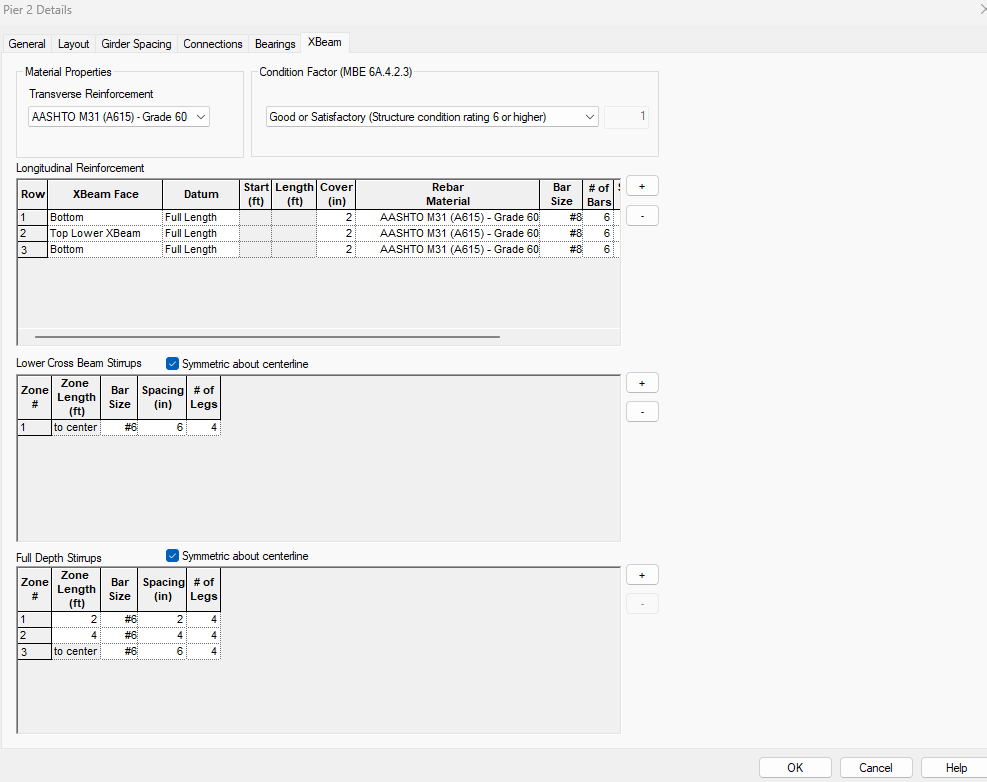

Materials and Reinforcement {#chapter3_material}
==============================================
 
## XBRate Materials and Reinforcement

### Material Properties
The material properties for the reinforcing steel is defined by selecting an option from the drop down list.

### Condition Factor
Enter the condition of the cross beam by selecting an option from the drop down list.

### Longitudinal Reinforcement
Multiple layers of longitudinal reinforcement can be defined for the cross beam. For each row enter the following parameters:

Parameter | Description
----------|---------------
XBeam Face | The face from which the reinforcement is located and the cover is measured. Bottom - reinforcement located from the bottom of the cross beam Top - reinforcement is located from the top of the cross beam for Expansion and Continuous piers, located from the top of the superstructure diaphragm for Integral piers Top Lower XBeam - reinforcement is located from the top of the lower cross beam for Integral piers
Datum | Defines the datum for locating reinforcement Full Length - reinforcement runs the full length of the cross beam Left End - reinforcement is located from the left end of the cross beam. Reinforcement is defined by its start location and length. Right End - reinforcement is located from the right end of the cross beam. Reinforcement is defined by its start location and length.
Start | Location of the start of the reinforcement (only used with Left End and Right End Datum)
End | Location of the end of the reinforcement (only used with Left End and Right End Datum)
Cover | Clear cover from the specified XBeam Face to the reinforcement
Rebar Material | Type and Grade used for longitudinal reinforcement
Bar Size | The size of the reinforcing bar
No.  of Bars | Number of reinforcing bars in the layer
Spacing | Center-to-center distance between reinforcing bars in the layer. Reinforcing bars are placed symmetrically about the center of the cross beam.
Left Hook | Indicates if the left end of the reinforcement is hooked. If hooked, it is considered to be fully developed at its left end
Right Hook | Indicates if the right end of the reinforcement is hooked. If hooked, it is considered to be fully developed at its right end

### Cross Beam\\Lower Cross Beam Stirrups
Defines the stirrups in the substructure portion of the cross beam as a sequence of zones. 

If the Symmetric about centerline is check, the zones are mirrored about the mid-point of the cross beam.

Parameter | Description
----------|------------
Zone Length | Length of the stirrup zone
Bar Size | The size of the reinforcement bar
Spacing | Spacing of the bars within the zone
No. of Legs | Number of stirrup legs at each bar location

The exact arrangement of reinforcement isn't that important. XBRate computes Av/S for each zone as (Abar)*(# Legs)/S and uses this value over the entire zone length.

### Full Depth Stirrups
Defines the stirrups that are anchored in the substructure portion of the cross beam and are extended into the superstructure diaphragm. This input is only applicable
to Integral piers.

The input is the same as described above.

## PGSuper/PGSplice Materials and Reinforcement
When integrated with PGSuper/PGSplice, the superstructure material is taken to be that of the deck and diaphragms. The substructure concrete material defined on the Layout tab of the Pier Details window as previously described.

The reinforcement is defined on the XBeam tab of the Pier Details windows. The XBeam tab is only shown in PGSuper/PGSplice if the XBRate extension is being used.

